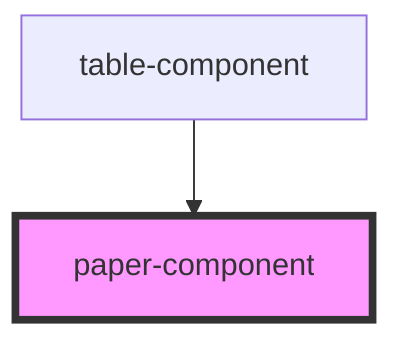

# paper-component

<!-- Auto Generated Below -->

## Properties

| Property    | Attribute   | Description | Type     | Default |
| ----------- | ----------- | ----------- | -------- | ------- |
| `elevation` | `elevation` |             | `number` | `1`     |

## Dependencies

### Used by

 - [table-component](../table-component)

### Graph

----------------------------------------------

*Built with [StencilJS](https://stenciljs.com/)*
